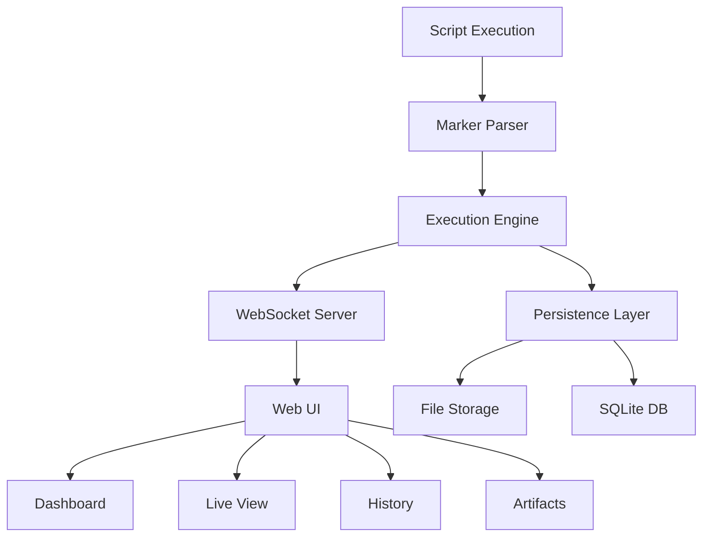

# 🏗️ ContainerFlow Visualizer - Marker Injection Architecture

## 🎯 Core Philosophy

**Minimal Marker Injection Strategy**: Users add simple markers to their scripts for precise step detection and visualization.

## 📋 Project Structure

```
ContainerFlow_Visualizer/
├── app/                           # Application core
│   ├── core/                      # Business logic
│   │   ├── __init__.py
│   │   ├── marker_parser.py       # Marker detection engine
│   │   ├── execution_engine.py    # Script execution handler
│   │   ├── persistence.py         # Data persistence layer
│   │   ├── websocket_server.py    # Real-time communication
│   │   └── auth.py                # Authentication (disabled)
│   ├── models/                    # Data models
│   │   ├── __init__.py
│   │   ├── execution.py           # Execution session model
│   │   ├── step.py                # Step model
│   │   └── artifact.py            # Artifact model
│   ├── api/                       # REST API endpoints
│   │   ├── __init__.py
│   │   ├── executions.py          # Execution management
│   │   ├── artifacts.py           # Artifact management
│   │   └── health.py              # Health checks
│   ├── static/                    # Static assets
│   │   ├── css/
│   │   ├── js/
│   │   └── images/
│   └── templates/                 # Frontend templates
│       ├── index.html             # Dashboard
│       ├── execution.html         # Live execution view
│       ├── history.html           # Execution history
│       └── artifacts.html         # Artifact browser
├── storage/                       # Persistent storage
│   ├── executions/                # Execution logs
│   ├── artifacts/                 # Generated artifacts
│   └── database/                  # SQLite database
├── docker/                        # Deployment files
│   ├── Dockerfile
│   ├── docker-compose.yml
│   └── nginx.conf
├── docs/                          # Documentation
│   ├── README_EN.md
│   ├── README_CN.md
│   ├── USER_GUIDE.md
│   └── API_REFERENCE.md
├── examples/                      # Usage examples
│   ├── shell_example.sh
│   ├── python_example.py
│   ├── dockerfile_example
│   └── README.md
├── tests/                         # Test suite
├── requirements.txt               # Python dependencies
├── Dockerfile                     # Main Docker image
├── docker-compose.yml             # Deployment orchestration
└── README.md                      # Main documentation
```

## 🚀 Core Components

### 1. Marker Parser Engine
- **Purpose**: Parse standardized markers in script output
- **Markers**: `STEP_START:`, `STEP_COMPLETE:`, `STEP_ERROR:`, `ARTIFACT:`
- **Real-time**: Process streaming output line by line

### 2. Execution Engine
- **Purpose**: Execute scripts and capture output
- **Features**: Real-time streaming, process management, timeout handling
- **Output**: Structured execution data with steps and logs

### 3. Persistence Layer
- **Database**: SQLite for simplicity
- **Storage**: File system for logs and artifacts
- **Retention**: Configurable cleanup policies

### 4. WebSocket Server
- **Purpose**: Real-time communication with frontend
- **Events**: Step updates, log streaming, completion notifications
- **Scalability**: Support multiple concurrent executions

### 5. Web UI System
- **Dashboard**: Overview of executions
- **Live View**: Real-time execution monitoring
- **History**: Browse past executions
- **Artifacts**: Download generated files

## 🔧 Marker Injection Format

### Standard Markers
```bash
# Step control
echo "STEP_START:Step Name"
echo "STEP_COMPLETE:Step Name"
echo "STEP_ERROR:Error description"

# Artifacts
echo "ARTIFACT:file.xml:Test Report"
echo "ARTIFACT:coverage.html:Coverage Report"

# Metadata
echo "META:ESTIMATED_DURATION:300"
echo "META:DESCRIPTION:This step does X"
```

### Python Example
```python
print("STEP_START:Data Processing")
# Your existing code here
df = process_data()
print("STEP_COMPLETE:Data Processing")
print("ARTIFACT:processed_data.csv:Processed Dataset")
```

### Shell Example
```bash
echo "STEP_START:Environment Setup"
pip install -r requirements.txt
echo "STEP_COMPLETE:Environment Setup"

echo "STEP_START:Model Training"
python train.py > training.log
echo "ARTIFACT:training.log:Training Output"
echo "STEP_COMPLETE:Model Training"
```

## 🐳 Docker Deployment

### Single Container
```yaml
services:
  containerflow:
    image: containerflow/visualizer
    ports:
      - "8080:8080"   # Web UI
      - "8765:8765"   # WebSocket
    volumes:
      - ./storage:/app/storage
      - ./scripts:/workspace
    environment:
      - AUTH_ENABLED=false
```

### Multi-Container (Future)
- Separate database container
- Redis for session management
- Nginx for load balancing

## 🔐 Authentication (Disabled)

### SSO Integration Points
- **OIDC/SAML**: Enterprise identity providers
- **RBAC**: Role-based access control
- **API Keys**: Programmatic access
- **Session Management**: Web session handling

**Current State**: All authentication bypassed, direct access to all features.

## 📊 Data Flow



## 🎯 Key Features

### Simplicity
- Minimal marker syntax
- Single Docker container deployment
- No external dependencies required

### Real-time
- Live step progress updates
- Streaming log output
- Instant artifact availability

### Persistence
- Complete execution history
- Downloadable artifacts
- Searchable logs

### Enterprise Ready
- SSO integration points
- RBAC preparation
- Audit logging
- API access

## 🚀 Getting Started

1. **Add markers to your script**:
   ```bash
   echo "STEP_START:My Process"
   # your code here
   echo "STEP_COMPLETE:My Process"
   ```

2. **Run with ContainerFlow**:
   ```bash
   docker run -p 8080:8080 containerflow/visualizer bash your_script.sh
   ```

3. **View in browser**: http://localhost:8080