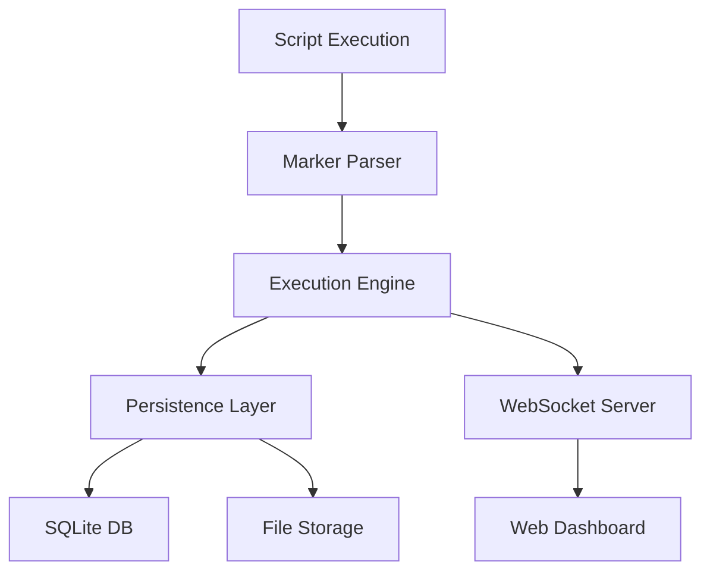

# 🔍 StepFlow Monitor

> **GitHub Actions-style visualization for any script execution**

StepFlow Monitor transforms your scripts into visual, step-by-step workflows with real-time monitoring and artifact collection. Perfect for CI/CD pipelines, data processing workflows, and development automation.

[🇺🇸 English](README.md) | [🇨🇳 中文](docs/README_CN.md)

## ✨ Features

- 🎯 **Minimal Marker Injection** - Add simple markers to existing scripts
- 📊 **Real-time Visualization** - GitHub Actions-style step display
- 🔄 **Live Log Streaming** - Watch your scripts execute in real-time
- 📦 **Artifact Collection** - Automatic file collection and download
- 🐳 **Docker Ready** - Single container deployment
- 🌐 **Web Dashboard** - Complete execution management interface
- 🔒 **Enterprise Ready** - SSO integration points (configurable)

## 🚀 Quick Start

### Using Docker (Recommended)

```bash
# Pull and run
docker run -d \
  --name stepflow \
  -p 8080:8080 \
  -p 8765:8765 \
  -v $(pwd)/scripts:/workspace \
  -v $(pwd)/storage:/app/storage \
  stepflow/monitor

# Open browser
open http://localhost:8080
```

### Using Docker Compose

```bash
# Clone repository
git clone https://github.com/your-org/stepflow-monitor
cd stepflow-monitor

# Start services
docker-compose up -d

# View logs
docker-compose logs -f
```

## 📋 Marker Integration

Transform any script with minimal markers:

### Shell Script Example
```bash
#!/bin/bash

echo "STEP_START:Environment Setup"
pip install -r requirements.txt
conda install tensorflow
echo "STEP_COMPLETE:Environment Setup"

echo "STEP_START:Model Training"  
python train_model.py
echo "ARTIFACT:model.pkl:Trained Model"
echo "ARTIFACT:training.log:Training Output"
echo "STEP_COMPLETE:Model Training"

echo "STEP_START:Model Evaluation"
python evaluate.py
echo "ARTIFACT:results.json:Evaluation Results"
echo "STEP_COMPLETE:Model Evaluation"
```

### Python Script Example
```python
print("STEP_START:Data Processing")
df = load_and_clean_data()
df.to_csv('cleaned_data.csv')
print("ARTIFACT:cleaned_data.csv:Cleaned Dataset")
print("STEP_COMPLETE:Data Processing")
```

### Docker Build Example
```dockerfile
FROM python:3.9
RUN echo "STEP_START:Base Image"
RUN echo "STEP_COMPLETE:Base Image"

COPY requirements.txt .
RUN echo "STEP_START:Dependencies"
RUN pip install -r requirements.txt
RUN echo "STEP_COMPLETE:Dependencies"
```

## 🎯 Execution Methods

### Method 1: Direct Execution
```bash
# Execute script with visualization
docker exec -it stepflow python /workspace/your_script.py
```

### Method 2: Via Web Interface
1. Open http://localhost:8080
2. Click "New Execution"
3. Enter command: `python /workspace/your_script.py`
4. Watch real-time execution

### Method 3: API Integration
```bash
curl -X POST http://localhost:8080/api/executions \
  -H "Content-Type: application/json" \
  -d '{"command": "python /workspace/your_script.py"}'
```

## 📊 Dashboard Features

### 🏠 Dashboard
- Execution statistics and overview
- Quick action buttons
- Recent executions list
- Active execution monitoring

### 📺 Live Execution View
- Real-time step progress
- Live log streaming
- Progress indicators
- Cancel execution capability

### 📜 Execution History
- Browse all past executions
- Filter by status, user, date
- Detailed execution information
- Log and artifact access

### 📦 Artifact Browser
- Download generated files
- File metadata and descriptions
- Organized by execution
- Persistent storage

## 🔧 Configuration

### Environment Variables
```bash
# Basic configuration
STEPFLOW_STORAGE_PATH=/app/storage
STEPFLOW_WEBSOCKET_PORT=8765
STEPFLOW_LOG_LEVEL=INFO

# Authentication (disabled by default)
STEPFLOW_AUTH_ENABLED=false
STEPFLOW_AUTH_METHOD=oidc
STEPFLOW_AUTH_OIDC_URL=https://your-oidc-provider
```

### Docker Compose Configuration
```yaml
services:
  stepflow:
    image: stepflow/monitor
    environment:
      - STEPFLOW_AUTH_ENABLED=false
    volumes:
      - ./storage:/app/storage
      - ./scripts:/workspace
    ports:
      - "8080:8080"
      - "8765:8765"
```

## 🏗️ Architecture



### Core Components
- **Marker Parser**: Detects and processes script markers
- **Execution Engine**: Manages script execution and monitoring
- **Persistence Layer**: Stores execution data and artifacts
- **WebSocket Server**: Provides real-time updates
- **Web Dashboard**: User interface for monitoring and management

## 📚 Documentation

- [📖 User Guide](docs/USER_GUIDE.md) - Complete usage instructions
- [🔧 API Reference](docs/API_REFERENCE.md) - REST API documentation
- [🚀 Deployment Guide](docs/DEPLOYMENT_GUIDE.md) - Production deployment
- [💡 Examples](examples/) - Script integration examples
- [🏗️ Architecture](ARCHITECTURE.md) - Technical architecture details

## 🔒 Enterprise Features

### SSO Integration (Configurable)
- OIDC/SAML support
- Role-based access control
- API key authentication
- Session management

### Security
- User isolation
- Audit logging
- Secure artifact storage
- Network policies

### Scalability
- Multiple execution engines
- Load balancing
- Database clustering
- Artifact archiving

## 🛠️ Development

### Local Development
```bash
# Clone repository
git clone https://github.com/your-org/stepflow-monitor
cd stepflow-monitor

# Install dependencies
pip install -r requirements.txt

# Run development server
python app/main.py
```

### Testing
```bash
# Run tests
pytest tests/

# Run with coverage
pytest --cov=app tests/
```

## 🤝 Contributing

1. Fork the repository
2. Create a feature branch
3. Add tests for new functionality
4. Ensure all tests pass
5. Submit a pull request

## 📄 License

MIT License - see [LICENSE](LICENSE) file for details.

## 🙋 Support

- 📖 **Documentation**: [docs/](docs/)
- 🐛 **Issues**: [GitHub Issues](https://github.com/your-org/stepflow-monitor/issues)
- 💬 **Discussions**: [GitHub Discussions](https://github.com/your-org/stepflow-monitor/discussions)
- 📧 **Email**: support@stepflow.dev

## 🌟 Star History

Give us a ⭐ if this project helped you!

---

**StepFlow Monitor Visualizer** - Bringing clarity to script execution, one step at a time.