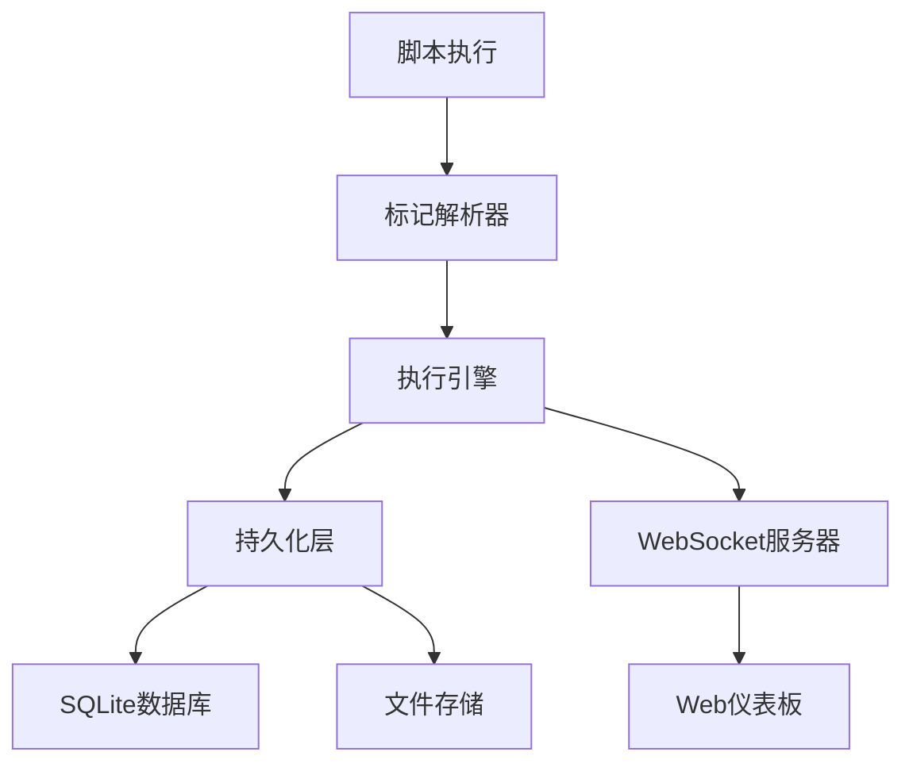

# 🐳 StepFlow Monitor

> **类似GitHub Actions的脚本执行可视化工具**

StepFlow Monitor 通过简单的标记注入将您的脚本转换为可视化的、分步骤的工作流，提供实时监控和工件收集功能。完美适用于CI/CD管道、数据处理工作流和开发自动化。

[🇺🇸 English](../README.md) | [🇨🇳 中文](README_CN.md)

## ✨ 核心特性

- 🎯 **最小标记注入** - 在现有脚本中添加简单标记
- 📊 **实时可视化** - GitHub Actions风格的步骤展示
- 🔄 **实时日志流** - 实时观看脚本执行过程
- 📦 **工件收集** - 自动文件收集和下载
- 🐳 **Docker就绪** - 单容器部署
- 🌐 **Web仪表板** - 完整的执行管理界面
- 🔒 **企业就绪** - SSO集成支持（可配置）

## 🏗️ 系统架构



### 核心组件
- **标记解析器**：检测和处理脚本标记
- **执行引擎**：管理脚本执行和监控
- **高性能持久化层**：优化的SQLite WAL模式，支持500+并发
- **WebSocket服务器**：提供实时更新
- **Web仪表板**：监控和管理用户界面

## ⚡ 性能特性

### 高并发支持
- **500+并发文本流**：通过SQLite WAL模式优化
- **连接复用**：消除连接建立开销
- **异步I/O**：非阻塞文件操作
- **批量写入**：提升数据库吞吐量

### 性能指标
- **数据库延迟**：<5ms 平均响应时间
- **文件I/O**：异步处理，不阻塞事件循环
- **内存使用**：500个并发流约200MB
- **吞吐量**：2000+ 数据库操作/秒

### 性能监控
- **实时指标**：`/api/health/metrics` 端点
- **性能优化**：`/api/health/optimize` 自动优化
- **资源监控**：CPU、内存、磁盘使用率
- **数据库统计**：WAL模式状态、缓存命中率

## 🚀 快速开始

### 使用Docker（推荐）

```bash
# 拉取并运行
docker run -d \
  --name stepflow \
  -p 8080:8080 \
  -p 8765:8765 \
  -v $(pwd)/scripts:/workspace \
  -v $(pwd)/storage:/app/storage \
  stepflow/monitor

# 打开浏览器
open http://localhost:8080
```

### 使用Docker Compose

```bash
# 克隆仓库
git clone https://github.com/your-org/stepflow-monitor
cd stepflow-monitor

# 启动服务
docker-compose up -d

# 查看日志
docker-compose logs -f
```

## 📋 标记集成

通过最小的标记改造现有脚本：

### Shell脚本示例
```bash
#!/bin/bash

echo "STEP_START:环境设置"
pip install -r requirements.txt
conda install tensorflow
echo "STEP_COMPLETE:环境设置"

echo "STEP_START:模型训练"  
python train_model.py
echo "ARTIFACT:model.pkl:训练好的模型"
echo "ARTIFACT:training.log:训练输出"
echo "STEP_COMPLETE:模型训练"

echo "STEP_START:模型评估"
python evaluate.py
echo "ARTIFACT:results.json:评估结果"
echo "STEP_COMPLETE:模型评估"
```

### Python脚本示例
```python
print("STEP_START:数据处理")
df = load_and_clean_data()
df.to_csv('cleaned_data.csv')
print("ARTIFACT:cleaned_data.csv:清理后的数据集")
print("STEP_COMPLETE:数据处理")
```

### Docker构建示例
```dockerfile
FROM python:3.9
RUN echo "STEP_START:基础镜像"
RUN echo "STEP_COMPLETE:基础镜像"

COPY requirements.txt .
RUN echo "STEP_START:依赖安装"
RUN pip install -r requirements.txt
RUN echo "STEP_COMPLETE:依赖安装"
```

## 🎯 执行方法

### 方法1：直接执行
```bash
# 执行脚本并可视化
docker exec -it stepflow python /workspace/your_script.py
```

### 方法2：通过Web界面
1. 打开 http://localhost:8080
2. 点击"新建执行"
3. 输入命令：`python /workspace/your_script.py`
4. 观看实时执行过程

### 方法3：API集成
```bash
curl -X POST http://localhost:8080/api/executions \
  -H "Content-Type: application/json" \
  -d '{"command": "python /workspace/your_script.py"}'
```

## 📊 仪表板功能

### 🏠 仪表板
- 执行统计和概览
- 快速操作按钮
- 最近执行列表
- 活跃执行监控

### 📺 实时执行视图
- 实时步骤进度
- 实时日志流
- 进度指示器
- 取消执行功能

### 📜 执行历史
- 浏览所有历史执行
- 按状态、用户、日期筛选
- 详细执行信息
- 日志和工件访问

### 📦 工件浏览器
- 下载生成的文件
- 文件元数据和描述
- 按执行分组
- 持久化存储

## 🔧 配置选项

### 环境变量
```bash
# 基础配置
STEPFLOW_STORAGE_PATH=/app/storage
STEPFLOW_WEBSOCKET_PORT=8765
STEPFLOW_LOG_LEVEL=INFO

# 认证设置（默认禁用）
STEPFLOW_AUTH_ENABLED=false
STEPFLOW_AUTH_METHOD=oidc
STEPFLOW_AUTH_OIDC_URL=https://your-oidc-provider
```

### Docker Compose配置
```yaml
services:
  stepflow:
    image: stepflow/monitor
    environment:
      - STEPFLOW_AUTH_ENABLED=false
    volumes:
      - ./storage:/app/storage
      - ./scripts:/workspace
    ports:
      - "8080:8080"
      - "8765:8765"
```

## 📋 标记类型

### 步骤控制标记
- `STEP_START:步骤名称` - 标记步骤开始
- `STEP_COMPLETE:步骤名称` - 标记步骤成功完成
- `STEP_ERROR:错误描述` - 标记步骤失败

### 工件标记
- `ARTIFACT:文件路径:描述` - 声明生成的文件为工件

### 元数据标记
- `META:键:值` - 提供额外的步骤元数据

## 🛠️ 高级用法

### 错误处理示例
```bash
echo "STEP_START:数据验证"

if validate_data.py; then
    echo "✅ 数据验证通过"
    echo "STEP_COMPLETE:数据验证"
else
    echo "❌ 数据验证失败"
    echo "STEP_ERROR:数据格式不正确或包含缺失值"
    exit 1
fi
```

### 元数据使用
```python
print("STEP_START:模型训练")
print("META:ESTIMATED_DURATION:300")
print("META:DESCRIPTION:训练深度学习模型")

# 训练代码
train_model()

print("ARTIFACT:model.h5:训练好的模型")
print("ARTIFACT:metrics.json:训练指标")
print("STEP_COMPLETE:模型训练")
```

### 条件执行
```bash
echo "STEP_START:可选优化"

if [ "$ENABLE_OPTIMIZATION" = "true" ]; then
    echo "执行模型优化..."
    optimize_model.py
    echo "ARTIFACT:optimized_model.pkl:优化后的模型"
    echo "STEP_COMPLETE:可选优化"
else
    echo "跳过优化步骤"
    echo "STEP_COMPLETE:可选优化"
fi
```

## 🚀 部署建议

### 开发环境
```bash
# 本地开发
git clone https://github.com/your-org/stepflow-monitor
cd stepflow-monitor

# 安装依赖
pip install -r requirements.txt

# 运行开发服务器
python app/main.py
```

### 测试环境  
```bash
# Docker单容器
docker build -t stepflow-monitor .
docker run -p 8080:8080 -p 8765:8765 stepflow-monitor
```

### 生产环境
```bash
# Docker Compose，带持久化和负载均衡
docker-compose up -d
```

## 🔍 故障排除

### 常见问题

**1. WebSocket连接失败**
```bash
# 检查端口是否被占用
netstat -an | grep 8765

# 检查防火墙设置
sudo ufw allow 8765
```

**2. 浏览器无法访问**
```bash
# 检查HTTP服务器
curl http://localhost:8080

# 检查Docker容器状态
docker ps | grep stepflow
```

**3. 标记没有被识别**
- 确保标记格式正确：`STEP_START:步骤名称`
- 检查标记前后没有额外的字符
- 查看容器日志：`docker logs stepflow`

**4. 工件没有显示**
- 确保文件路径正确
- 检查文件是否在容器的可访问路径内
- 验证ARTIFACT标记格式：`ARTIFACT:文件路径:描述`

## 🏗️ 企业级功能

### SSO集成（可配置）
- OIDC/SAML支持
- 基于角色的访问控制
- API密钥认证
- 会话管理

### 安全性
- 用户隔离
- 审计日志
- 安全的工件存储
- 网络策略

### 可扩展性
- 多执行引擎
- 负载均衡
- 数据库集群
- 工件归档

## 🛠️ 开发

### 本地开发
```bash
# 克隆仓库
git clone https://github.com/your-org/stepflow-monitor
cd stepflow-monitor

# 安装依赖
pip install -r requirements.txt

# 运行开发服务器
python app/main.py
```

### 测试
```bash
# 运行测试
pytest tests/

# 运行覆盖率测试
pytest --cov=app tests/
```

## 📚 文档

- [📖 用户指南](docs/USER_GUIDE.md) - 完整的使用说明
- [🔧 API参考](docs/API_REFERENCE.md) - REST API文档
- [🚀 部署指南](docs/DEPLOYMENT_GUIDE.md) - 生产环境部署
- [💡 示例](examples/) - 脚本集成示例
- [🏗️ 架构](ARCHITECTURE.md) - 技术架构详情

## 🤝 贡献

1. Fork 仓库
2. 创建功能分支
3. 为新功能添加测试
4. 确保所有测试通过
5. 提交 Pull Request

## 📄 许可证

MIT License - 详见 [LICENSE](LICENSE) 文件。

## 🙋 支持

- 📖 **文档**: [docs/](docs/)
- 🐛 **问题**: [GitHub Issues](https://github.com/your-org/stepflow-monitor/issues)
- 💬 **讨论**: [GitHub Discussions](https://github.com/your-org/stepflow-monitor/discussions)
- 📧 **邮箱**: support@stepflow.dev

## 🌟 Star历史

如果这个项目对您有帮助，请给我们一个 ⭐！

---

**StepFlow Monitor** - 让脚本执行过程更清晰，一步一个脚印。